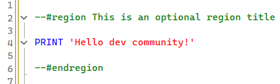
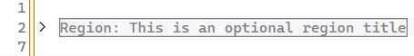

# SsmsRegions

SSMS extension to add support for collapsible named regions.


It's a piece of software that was quickly vibe-coded for myself and doesn't claim to be particularly polished. No settings, no UI, no bells and whistles, just this one feature. No further updates planned.

Compatible with **SQL Server Management Studio 22.6.0** (and probably others; I haven't tested).

## Syntax:
```sql
--#region This is an optional region title

PRINT 'Hello dev community!'

--#endregion
```

## Screenshots
Expanded state:<br>


Collapsed state (default on file open):<br>


## Install
Download or compile and start `SsmsRegions.vsix`

## Uninstall
Execute to uninstall:

```
cd "%ProgramFiles%\Microsoft SQL Server Management Studio 22\Release\Common7\IDE\"

VSIXInstaller.exe /uninstall:SsmsRegions.00420f61-39aa-4105-ab58-c84742c7d30d
```

## License

Public domain. Feel free to download, fork, extend, re-release, integrate, whatever you like!

This software is provided "as-is", without any express or implied warranty; in no event will the author be liable for any damages arising from the use of this software.

